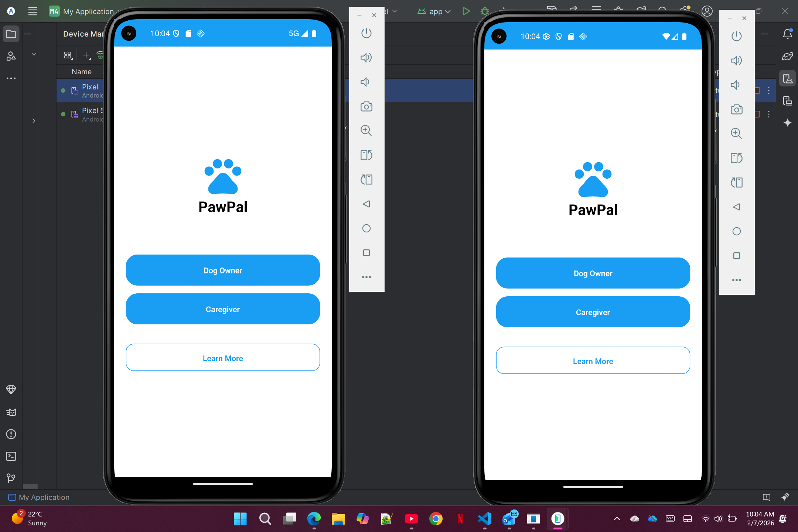
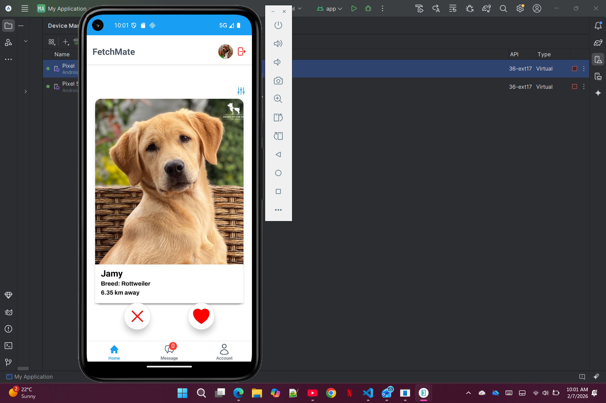
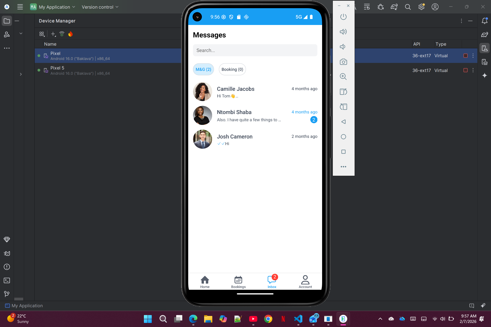
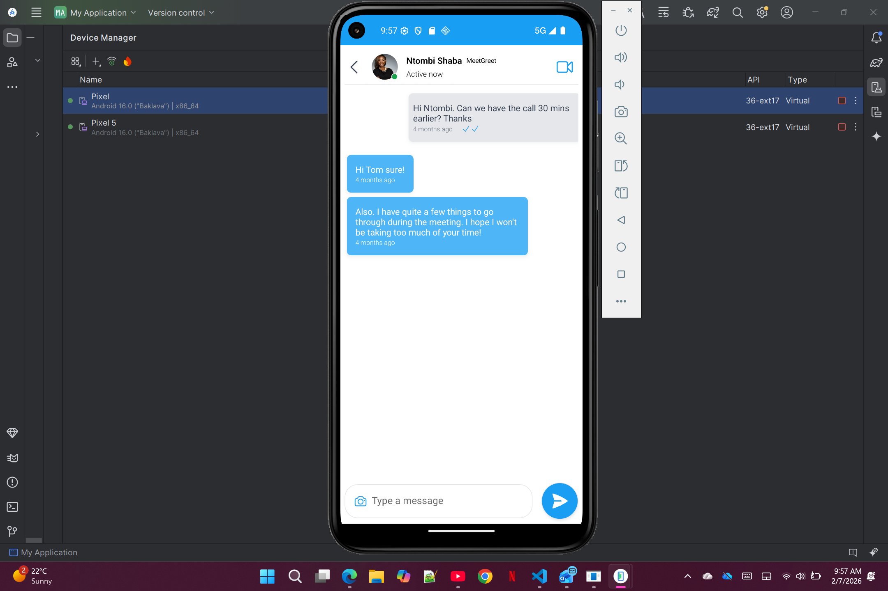
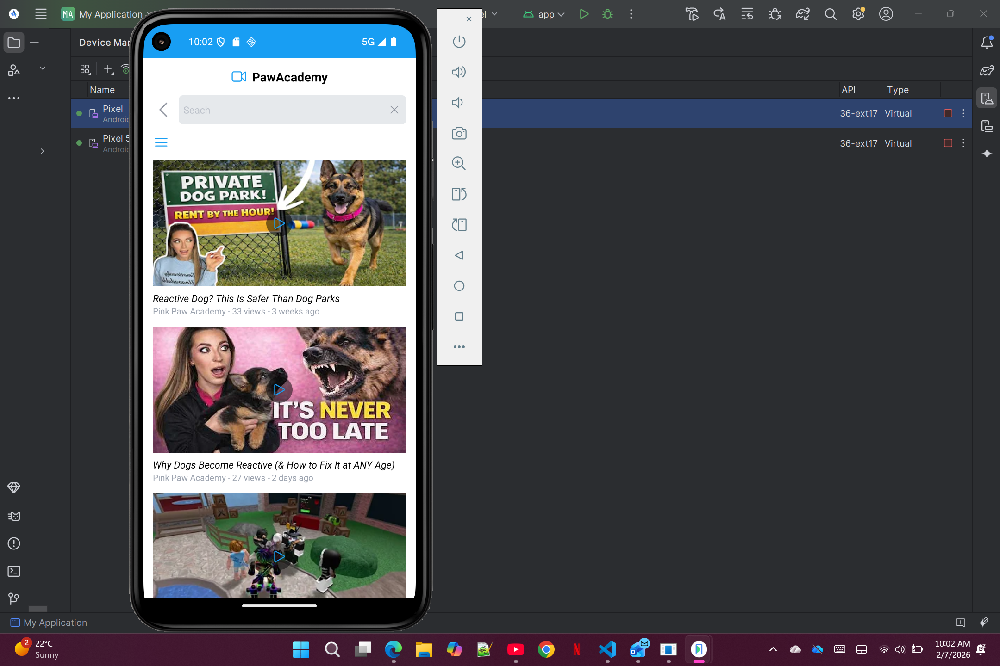
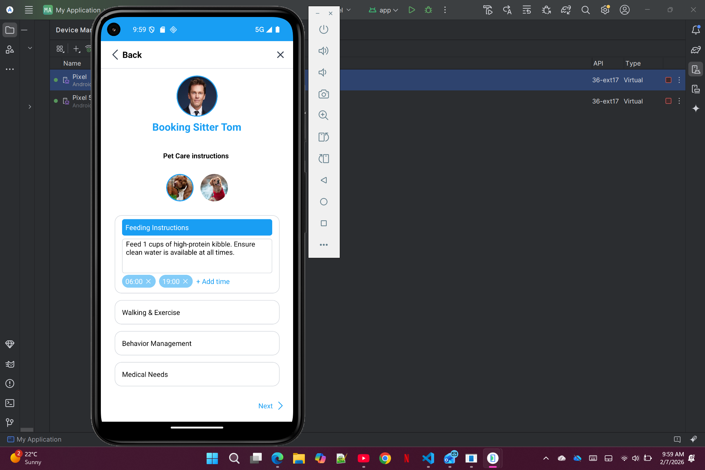

# PawPal-Overview

# PawPAL – Final Year Computer Science Project (University of Johannesburg)

**Project Type:** Full-Stack Mobile Application / Data-Driven Platform  
**Role:** Full-Stack Developer (Team Project)  
**Team Size: 4 members
**Duration:** February 2025 – November 2025  
**Technologies:\*\* React Native, Expo, RESTful APIs, SQL, Git, Power BI, Machine Learning (matching algorithm)

---

## Project Overview

PawPAL is a **team-based final-year project** designed to connect dog owners with compatible dogs, caregivers, and pet services. It demonstrates **end-to-end development**, advanced features, and data-driven functionality.

Key features include:

- **Dog Matching System (FetchMate):** Tinder-style swipe system to match dogs with other dogs based on user preferences.
- **Caregiver Booking System:** ML-powered matching between dogs and caregivers based on preferences and availability.
- **Find a Vet:** Search for nearby veterinarians with location-based suggestions.
- **PawAcademy:** Educational video library for dog wellness and training.
- **Messaging System:** In-app messaging between users and caregivers.
- **Analytics & Reporting:** Dashboards to monitor engagement, user activity, and system usage.

---

## Deployment / Demo

The mobile application is **deployed via Expo**:  
[Live Build – PawPAL](https://expo.dev/accounts/pawpalproj/projects/pawpal/builds/5041b63c-3f8f-4b71-8660-78a279007389)

---

## Source Code

**Note:** Full source code is maintained in University of Johannesburg repositories and may require access permissions.

Public overview of repositories:

- **Mobile App (React Native):** [team31-mobile](https://github.com/IFMTYP2025/team31-mobile)
- **Backend API (RESTful):** [team31-api](https://github.com/IFMTYP2025/team31-api)
- **Web Application & Analytics:** [team31](https://github.com/IFMTYP2025/team31)

---

## Screenshots

_(Add 3–5 key screenshots)_

  
  
  

> core functionality of the mobile application, caregiver booking system, and analytics dashboards.

  
  

  
 
---

## Skills Demonstrated

- **Full-Stack Development:** React Native, Expo, RESTful APIs, SQL
- **Data & Analytics:** Usage tracking, dashboards, data visualization
- **Machine Learning:** Matching algorithm to connect dogs and caregivers
- **Collaboration & Version Control:** Team coordination using Git and GitHub
- **Deployment & Testing:** Expo build, live deployment, mobile app testing

---

## Key Learnings

- Executing a **large-scale team project** from planning to live deployment
- Integrating **multiple modules** (matching system, bookings, messaging, analytics)
- Implementing **machine learning logic** in a real-world app
- Collaborative development using Git, code reviews, and agile practices
- Designing **user-centric features** for mobile platforms

---

## Contact / Portfolio

For questions or additional details, feel free to contact:  
**Mutsa Sanyamahwe** – sanyamahwemutsa@gmail.com | [GitHub](https://github.com/MutsaSanyamahwe)
